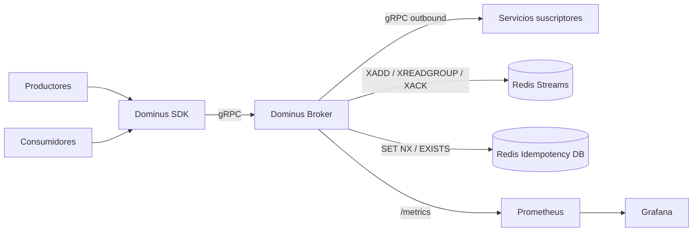
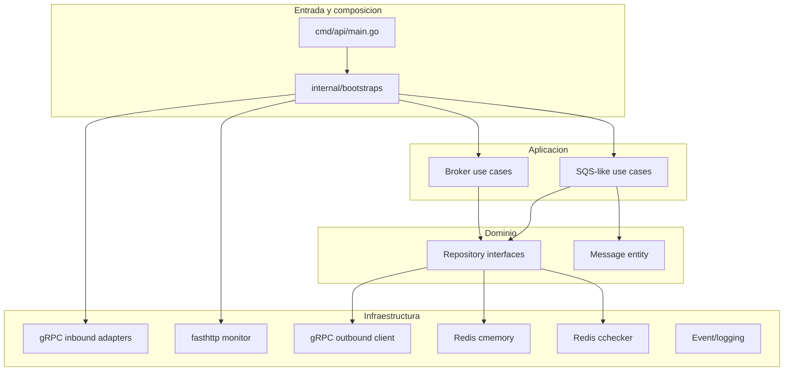
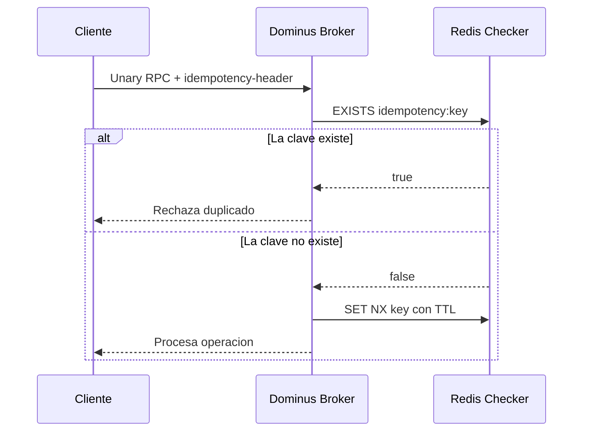
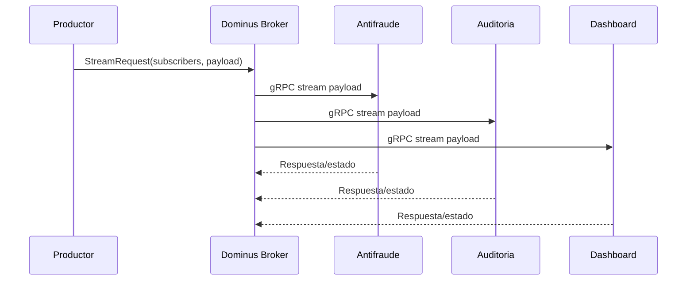
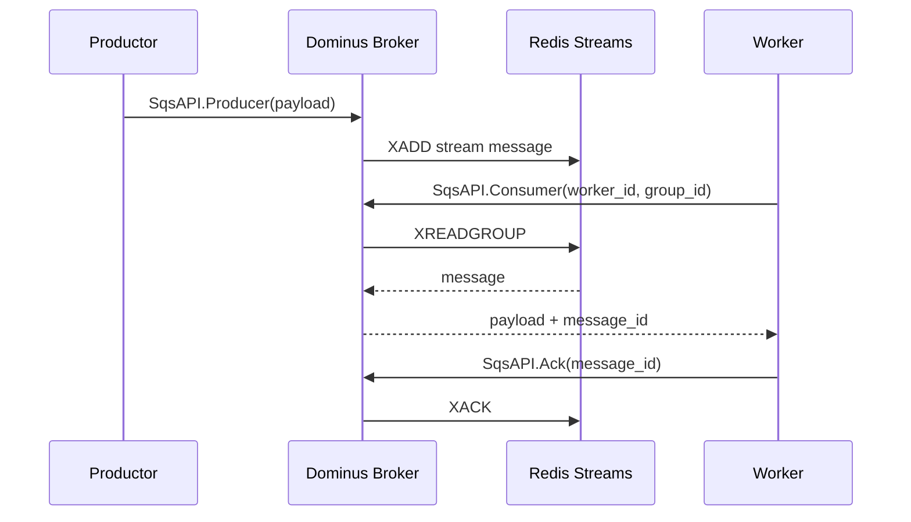
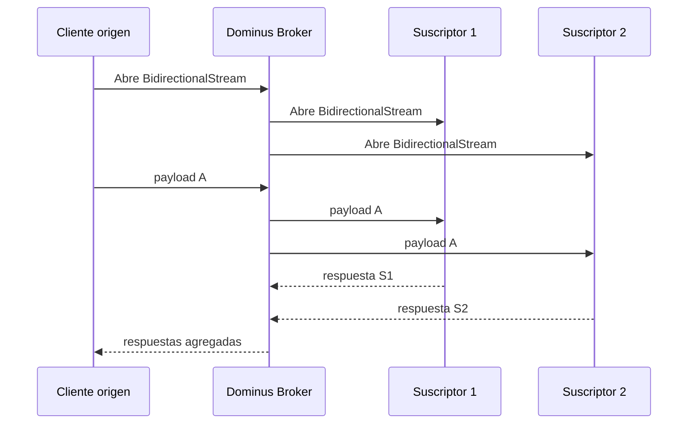
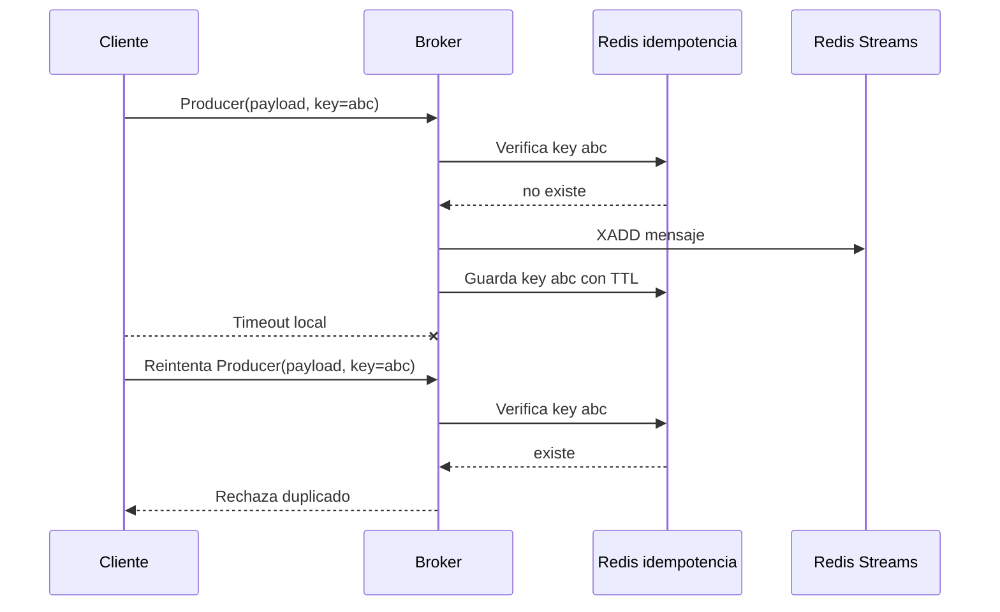
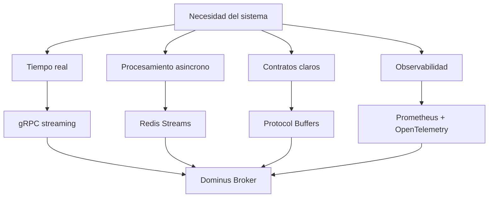

# Guia de justificacion y defensa del proyecto Dominus

## 1. Proposito de este documento

Este documento esta pensado para defender el proyecto Dominus frente a preguntas academicas o tecnicas.

Responde:

- por que existe este proyecto;
- que problema intenta resolver;
- que arquitectura usa;
- que casos de uso reales puede cubrir;
- que tan bien cumple su objetivo;
- que soluciones existentes hacen algo parecido;
- que tiene de bueno;
- que tiene de malo;
- que puntos se deben defender con cuidado.

La idea principal no es vender Dominus como un reemplazo directo de Kafka, RabbitMQ, NATS, Pulsar o Redis Streams.

La defensa mas fuerte es otra:

> Dominus es un prototipo academico de broker hibrido que integra comunicacion en tiempo real mediante gRPC y consumo asincrono tipo cola mediante Redis Streams, con una arquitectura desacoplada que permite estudiar patrones de mensajeria, idempotencia, fan-out, fan-in y observabilidad en un sistema implementado.

## 2. Por que existe Dominus

Dominus existe porque muchos sistemas distribuidos modernos necesitan dos comportamientos al mismo tiempo:

1. Comunicacion inmediata.

   Por ejemplo, un servicio publica un evento y otros servicios necesitan recibirlo casi en tiempo real.

2. Comunicacion desacoplada.

   Por ejemplo, un productor genera mensajes, pero los consumidores pueden procesarlos despues, a su propio ritmo, con confirmacion de procesamiento.

Normalmente estas necesidades se resuelven con herramientas distintas:

- REST o gRPC para comunicacion directa;
- Kafka, RabbitMQ, NATS, Pulsar, Redis Streams o Pub/Sub para mensajeria asincrona;
- librerias propias para idempotencia, reintentos y control de duplicados;
- SDKs internos para no repetir configuracion de clientes.

Dominus intenta unir esas ideas en una propuesta compacta:

- gRPC para transporte eficiente y streaming;
- Redis Streams para persistencia temporal y consumo pull;
- Redis key-value para idempotencia;
- protobuf para contratos;
- SDK para facilitar el consumo;
- observabilidad con Prometheus y OpenTelemetry;
- arquitectura limpia/hexagonal para separar casos de uso e infraestructura.

## 3. Problema central que busca resolver

El problema central se puede redactar asi:

> En arquitecturas distribuidas orientadas a eventos, existe una brecha entre la comunicacion en tiempo real de baja latencia y la mensajeria asincrona desacoplada con control de procesamiento. Dominus propone un broker hibrido que combina ambos modelos en una misma arquitectura usando gRPC y Redis.

Esta frase es defendible porque no promete reemplazar plataformas maduras.
Promete integrar y estudiar dos modelos.

## 4. Objetivo tecnico de Dominus

El objetivo tecnico de Dominus es demostrar que se puede construir un broker con estas capacidades:

- recibir mensajes desde productores;
- distribuir mensajes a uno o varios suscriptores;
- manejar streams gRPC de cliente, servidor y bidireccionales;
- almacenar mensajes de forma temporal en Redis Streams;
- permitir consumo pull mediante una API tipo cola;
- confirmar mensajes mediante ack;
- evitar reprocesamiento con idempotencia basica;
- exponer metricas y health checks;
- separar contrato, runtime y SDK.

## 5. Arquitectura general

Dominus usa una arquitectura por capas con intencion limpia/hexagonal.

Las responsabilidades se separan asi:

- `dominus-proto-definition`: contrato protobuf y servicios gRPC.
- `dominus-broker`: runtime del broker.
- `dominus-sdk`: helpers para clientes y servidores Go.
- `Redis`: almacenamiento temporal e idempotencia.
- `Prometheus/OpenTelemetry`: observabilidad.

## 6. Arquitectura interna del broker

`dominus-broker` se organiza con capas:

Esta arquitectura busca que la logica de aplicacion no dependa directamente de Redis, gRPC o fasthttp.
Las tecnologias quedan en adaptadores.

## 7. Por que usa gRPC

Dominus usa gRPC porque el proyecto necesita:

- contratos fuertes con protobuf;
- baja sobrecarga frente a JSON/HTTP tradicional;
- streaming de cliente;
- streaming de servidor;
- streaming bidireccional;
- interceptores para seguridad, metricas y logging;
- compatibilidad con servicios distribuidos.

La documentacion oficial de gRPC describe estos modelos de RPC, incluyendo server streaming y bidirectional streaming, y menciona que los mensajes mantienen orden dentro de una llamada RPC individual.

Esto encaja con Dominus porque el proyecto no solo necesita request-response, sino flujos persistentes.

## 8. Por que usa Redis Streams

Redis Streams se usa para la parte asincrona.

Dominus necesita:

- guardar mensajes temporalmente;
- permitir que consumidores los pidan despues;
- organizar consumidores por grupo;
- confirmar procesamiento con ack;
- mantener baja latencia y despliegue simple.

Redis Streams ofrece operaciones como:

- `XADD` para agregar mensajes;
- `XREADGROUP` para leer desde consumer groups;
- `XACK` para confirmar mensajes procesados.

Esto permite implementar una cola ligera sin levantar una plataforma mas pesada.

## 9. Por que usa Redis tambien para idempotencia

La idempotencia busca evitar que una operacion logica se procese mas de una vez.

Dominus usa Redis como almacenamiento de claves:

- recibe un `idempotency-header`;
- revisa si la clave existe;
- si no existe, la guarda con TTL;
- si existe, rechaza la operacion como duplicada.

Punto importante para defensa:

La idea es correcta, pero la implementacion actual no es perfecta porque el guardado se hace de forma asincrona despues de comprobar existencia.
Para una garantia mas fuerte, se deberia reservar la clave de forma atomica con `SET NX` antes de ejecutar el handler.

## 10. Por que usa un SDK

El SDK existe porque un broker no solo necesita servidor.
Tambien necesita que los clientes lo puedan usar de forma consistente.

Sin SDK, cada cliente tendria que repetir:

- configuracion gRPC;
- TLS o modo inseguro;
- metadata `x-api-key`;
- metadata de idempotencia;
- validacion de direcciones;
- creacion de clientes;
- manejo de streams.

El SDK reduce ese codigo repetido y define una experiencia de uso comun.

## 11. Casos de uso reales

### Caso de uso 1: Notificacion en tiempo real a multiples servicios

Un productor envia eventos de una operacion y varios servicios deben recibirlos al mismo tiempo.

Ejemplo real:

- sistema de pagos;
- servicio antifraude;
- servicio de auditoria;
- servicio de notificaciones;
- dashboard operacional.

Por que Dominus sirve aqui:

- permite fan-out;
- usa canales persistentes;
- no obliga a cada productor a conocer la logica interna de cada consumidor.

### Caso de uso 2: Procesamiento asincrono de tareas

Un productor genera trabajos, pero los consumidores los procesan cuando tienen capacidad.

Ejemplo real:

- procesamiento de documentos;
- envio de correos;
- generacion de reportes;
- transformacion de datos.

Por que Dominus sirve aqui:

- desacopla productor y consumidor;
- permite pull;
- usa ack para confirmar procesamiento.

### Caso de uso 3: Comunicacion bidireccional entre servicios

Un servicio envia datos a varios suscriptores y tambien recibe respuestas durante la misma conexion.

Ejemplo real:

- coordinacion de telemetria;
- sistemas de monitoreo;
- sesiones colaborativas;
- orquestacion de tareas distribuidas.

Por que Dominus sirve aqui:

- gRPC bidirectional streaming permite mantener una sesion viva;
- el broker coordina multiples endpoints;
- el cliente origen no necesita gestionar directamente cada conexion.

### Caso de uso 4: Reintentos controlados con idempotencia

Un cliente reintenta una operacion porque no sabe si fallo la red o fallo el procesamiento.

Por que Dominus sirve aqui:

- introduce la preocupacion de duplicados en el broker;
- reduce carga de implementacion en clientes;
- hace visible un problema real de sistemas distribuidos.

## 12. Mapa de capacidades

| Capacidad | Dominus la cubre | Como |
|---|---:|---|
| Contratos formales | Si | Protobuf |
| Streaming cliente-servidor | Si | `BrokerAPI.ClientStream` |
| Streaming servidor-cliente | Si | `BrokerAPI.ServerStream` |
| Streaming bidireccional | Si | `BrokerAPI.BidirectionalStream` |
| Fan-out | Si | Outbound gRPC a multiples suscriptores |
| Fan-in | Parcial | Agregacion de respuestas desde suscriptores |
| Cola pull | Si | `SqsAPI.Consumer` + Redis Streams |
| Ack | Si | `SqsAPI.Ack` + `XACK` |
| Idempotencia | Parcial | Redis checker con TTL |
| Observabilidad | Si | Prometheus, OpenTelemetry, logs |
| Durabilidad fuerte | Parcial | Depende de Redis y su configuracion |
| Backpressure avanzado | Limitado | No hay control robusto de fan-out |
| Escalado productivo | Parcial | Requiere hardening |

## 13. Logra su objetivo?

Respuesta corta:

Si, como prototipo academico y sistema experimental.
No completamente, si se evalua como broker productivo maduro.

### Por que si lo logra

Dominus logra demostrar que:

- gRPC puede ser usado como canal de broker streaming;
- Redis Streams puede respaldar un flujo asincrono tipo cola;
- es viable separar contrato, broker y SDK;
- se pueden implementar modos de comunicacion distintos en una misma solucion;
- la arquitectura por capas permite aislar gRPC, Redis y casos de uso;
- la observabilidad puede integrarse desde el diseno.

Eso cumple bien el objetivo academico: demostrar una propuesta funcional y argumentable.

### Por que no lo logra completamente como producto final

Dominus no alcanza todavia el nivel de un broker productivo maduro porque:

- la idempotencia no es totalmente atomica;
- fan-out puede crecer sin limites de goroutines;
- la estrategia de reintentos es agresiva;
- TLS puede degradarse a inseguro si faltan archivos;
- no hay control avanzado de particionado, orden global o replicacion;
- la durabilidad depende de Redis y su configuracion;
- no hay gestion avanzada de DLQ, redelivery, cuotas o multi-tenant;
- parte de la documentacion parece desincronizada con el codigo.

La defensa correcta es:

> Dominus logra su objetivo como prototipo de investigacion e implementacion. Para uso productivo, requiere endurecimiento en idempotencia, backpressure, seguridad, operacion y tolerancia a fallos.

## 14. Existe algo que haga lo mismo?

Si existen soluciones que cubren partes importantes del problema, e incluso son mas maduras.

Pero no todas hacen exactamente lo mismo en el mismo enfoque.

### Kafka

Kafka es una plataforma de event streaming.
La documentacion oficial indica que permite publicar eventos en topics y proporciona garantias como procesamiento exactly-once.

Kafka es mas maduro que Dominus para:

- throughput alto;
- persistencia distribuida;
- procesamiento de eventos;
- escalabilidad;
- ecosistema productivo.

Pero Kafka no es lo mismo que Dominus porque:

- no esta centrado en gRPC como contrato principal de streaming;
- su modelo operativo es mas pesado;
- no busca ser un SDK/broker academico ligero;
- su proposito es una plataforma de streaming distribuida, no un broker hibrido experimental basado en gRPC.

### RabbitMQ

RabbitMQ es un broker AMQP maduro.
Soporta exchanges, colas, acknowledgements y publisher confirms.

RabbitMQ es mas fuerte que Dominus para:

- enrutamiento de mensajes;
- colas clasicas;
- patrones AMQP;
- operacion establecida.

Pero no es lo mismo porque:

- no tiene gRPC streaming como interfaz central;
- su modelo principal es AMQP;
- no esta construido como demostracion de arquitectura limpia con gRPC + Redis.

### NATS JetStream

NATS con JetStream soporta persistencia, replay, acknowledgements y consumidores push/pull.
La documentacion oficial explica que JetStream permite capturar mensajes y reproducirlos, y que sus streams ofrecen calidad base at-least-once.

NATS JetStream se parece bastante en objetivos:

- baja latencia;
- pub/sub;
- consumo persistente;
- pull consumers;
- escalabilidad.

Pero no es lo mismo porque:

- usa protocolo y ecosistema NATS;
- ya es una plataforma madura;
- Dominus estudia una combinacion propia de gRPC, Redis y SDK.

### Apache Pulsar

Pulsar soporta pub/sub, acknowledgements, modos de suscripcion, retencion y redelivery.
Su documentacion explica que puede combinar fan-out pub/sub y message queuing usando distintos modos de suscripcion.

Pulsar es mas fuerte que Dominus para:

- multi-tenancy;
- retencion;
- subscripciones;
- redelivery;
- arquitectura distribuida.

Pero no es lo mismo porque:

- su infraestructura es mas compleja;
- no usa Redis Streams como base;
- no se centra en gRPC como mecanismo educativo principal.

### Redis Streams

Redis Streams por si mismo ya cubre parte de lo que Dominus hace:

- `XADD`;
- consumer groups;
- `XREADGROUP`;
- `XACK`.

Pero Redis Streams solo es la estructura de datos.
Dominus agrega:

- API gRPC;
- SDK;
- fan-out streaming;
- middleware;
- observabilidad;
- arquitectura de broker.

### Google Cloud Pub/Sub

Google Cloud Pub/Sub ofrece push y pull subscriptions.
Es una plataforma gestionada y madura.

Pero no es lo mismo porque:

- depende de nube gestionada;
- no es un prototipo desplegable localmente como Dominus;
- no busca estudiar la implementacion interna de un broker.

## 15. Entonces, cual es la justificacion real?

La justificacion no debe ser:

"No existe nada parecido."

Eso seria falso o debil.

La justificacion correcta es:

> Existen soluciones maduras que resuelven partes del problema, pero Dominus se justifica como proyecto academico porque implementa una arquitectura propia que integra gRPC streaming, Redis Streams, idempotencia, SDK y observabilidad en un prototipo controlado. Esto permite estudiar directamente los compromisos de diseno entre baja latencia, desacoplamiento, consistencia, consumo pull y simplicidad operativa.

## 16. Lo bueno del proyecto

Fortalezas:

- La idea hibrida es clara.
- Usa gRPC donde gRPC aporta valor real: streaming y contratos.
- Usa Redis Streams de forma razonable para cola ligera.
- Separa contrato, runtime y SDK.
- Tiene observabilidad desde el inicio.
- Tiene pruebas unitarias e integracion.
- Documenta trade-offs.
- Permite explicar patrones reales: fan-out, fan-in, pull, ack, idempotencia.
- Es buen material para un TFM porque mezcla investigacion, arquitectura e implementacion.

## 17. Lo malo o debil del proyecto

Debilidades:

- No compite realmente con brokers maduros en produccion.
- La idempotencia debe hacerse atomica.
- El fan-out necesita limites y backpressure.
- El manejo de TLS no deberia depender solo de existencia de archivos.
- La documentacion debe sincronizarse con el codigo.
- Algunas validaciones y errores son mejorables.
- El uso de Redis debe explicar claramente limites de durabilidad.
- El SDK puede tener validaciones de URI demasiado rigidas.
- Falta una historia mas fuerte de escalado horizontal.
- El nombre `SqsAPI` puede confundir porque no es AWS SQS.

## 18. Como defenderlo ante preguntas dificiles

### Pregunta: Por que no usar Kafka?

Respuesta:

Kafka es mejor para event streaming productivo a gran escala.
Dominus no busca reemplazar Kafka.
Dominus busca estudiar una arquitectura hibrida con gRPC streaming, Redis Streams e idempotencia en un prototipo implementado y controlable.

### Pregunta: Por que no usar RabbitMQ?

Respuesta:

RabbitMQ es una solucion madura para AMQP y colas.
Dominus tiene otro enfoque: usa gRPC como contrato principal y combina streaming en tiempo real con cola pull respaldada por Redis.

### Pregunta: Por que no usar solo Redis Streams?

Respuesta:

Redis Streams cubre almacenamiento y consumer groups, pero no ofrece por si solo una API gRPC, SDK, fan-out streaming, middlewares, observabilidad ni organizacion arquitectonica de broker.

### Pregunta: Dominus garantiza exactly-once?

Respuesta:

No se debe afirmar exactly-once absoluto.
Dominus implementa una forma de idempotencia y ack que reduce duplicados, pero la garantia actual es parcial.
Para una garantia mas fuerte hay que usar una reserva atomica de idempotency key y definir claramente las ventanas de reintento.

### Pregunta: Es productivo?

Respuesta:

Es un prototipo funcional con buenas bases, pero necesita hardening para produccion.
Su valor academico esta en demostrar, analizar y evaluar la arquitectura.

## 19. Diagrama de decision de tecnologia

## 20. Fuentes tecnicas consultadas

Estas fuentes sirven para respaldar comparaciones y justificacion:

- gRPC Core Concepts: https://grpc.io/docs/what-is-grpc/core-concepts/
- Redis Streams: https://redis.io/docs/latest/develop/data-types/streams/
- Redis XREADGROUP: https://redis.io/docs/latest/commands/xreadgroup/
- Redis XACK: https://redis.io/docs/latest/commands/xack/
- Apache Kafka documentation: https://kafka.apache.org/documentation/
- Apache Kafka design: https://kafka.apache.org/42/design/design/
- RabbitMQ acknowledgements and confirms: https://www.rabbitmq.com/docs/3.13/confirms
- NATS JetStream: https://docs.nats.io/nats-concepts/jetstream
- NATS JetStream consumers: https://docs.nats.io/nats-concepts/jetstream/consumers
- Apache Pulsar messaging concepts: https://pulsar.apache.org/docs/2.11.x/concepts-messaging/
- Google Cloud Pub/Sub overview: https://docs.cloud.google.com/pubsub/docs/pubsub_overview
- Google Cloud Pub/Sub pull subscriptions: https://docs.cloud.google.com/pubsub/docs/pull

## 21. Conclusion para defensa

Dominus es defendible si se presenta como un prototipo academico de broker hibrido.

Su aportacion no esta en superar a brokers industriales.
Su aportacion esta en integrar y demostrar, en un sistema propio:

- comunicacion gRPC en tiempo real;
- mensajeria asincrona pull con Redis Streams;
- contratos protobuf;
- SDK de consumo;
- idempotencia;
- observabilidad;
- arquitectura desacoplada.

La defensa mas madura reconoce sus limites.
Eso fortalece el proyecto porque muestra criterio tecnico:

- Dominus funciona como demostrador;
- alternativas maduras existen;
- la propuesta tiene valor por integracion, aprendizaje, control arquitectonico y evaluacion experimental;
- para produccion se requiere endurecimiento.
