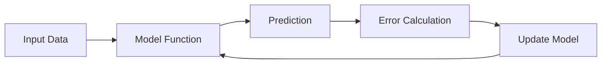

## 1. What You Actually Need to Learn (Minimal Math Path)

### 1.1 Core Math for Machine Learning

You do **NOT** need full university math. Focus on:

| Area                   | Why it matters                        |
| ---------------------- | ------------------------------------- |
| Algebra                | Understanding equations and variables |
| Functions              | Mapping inputs to outputs (f(x))      |
| Basic Statistics       | Mean, variance, distributions         |
| Probability            | Understanding uncertainty             |
| Linear Algebra (light) | Vectors, matrices (for ML models)     |

---

### 1.2 How ML Formulas Work Conceptually

Most ML formulas follow this pattern:



---

### 1.3 Example Breakdown Mindset

When you see a formula like:

$$  
MSE = \frac{1}{n} \sum (y_i - \hat{y}_i)^2  
$$

You should read it as:

1. Take real value (y)
    
2. Subtract prediction (ŷ)
    
3. Square the error
    
4. Average all errors
    

This is the **skill you want to build**: translating math → steps.

---

## 2. Best Online Courses (Beginner-Friendly)

### 2.1 Absolute Best Starting Point

#### Andrew Ng – Machine Learning Specialization

- Platform: Coursera
    
- Level: Beginner
    
- Why:
    
    - Explains formulas intuitively
        
    - Minimal math required
        
    - Strong foundation
        

---

### 2.2 If You Want Even Simpler Math First

#### Khan Academy (Free)

Focus on:

- Algebra basics
    
- Statistics & probability
    

Use it as a **support**, not your main course.

---

### 2.3 For Developers (Best Fit for You)

#### Fast.ai – Practical Deep Learning

- Focus: Code first, math later
    
- Great for:
    
    - Developers transitioning into AI
        
    - Learning by doing
        

---

### 2.4 Visual Learning (Highly Recommended for You)

#### 3Blue1Brown (YouTube)

- Best for:
    
    - Intuition
        
    - Visual understanding of math
        
- Especially:
    
    - Linear algebra series
        
    - Neural networks series
        

---

## 3. How to Read Algorithms (Step-by-Step Method)

### 3.1 Universal Strategy

When you see any formula:

1. Identify variables
    
2. Identify operations (sum, average, max, etc.)
    
3. Translate to plain language
    
4. Convert to steps
    

---

### 3.2 Example: Precision

$$  
Precision = \frac{TP}{TP + FP}  
$$

#### How to read it:

- TP = correct positives
    
- FP = incorrect positives
    

#### Step-by-step:

1. Count predicted positives
    
2. Check how many were correct
    
3. Divide correct / total predicted positives
    

---

## 4. Bridge From Your Background (Important)

You already have strong advantages:

|Your Skill|How it Helps in ML|
|---|---|
|Animation|Understanding systems & flows|
|UX|Thinking in user outcomes|
|Software dev|Implementing models|
|Master’s in AI|You already have context|

---

### 4.1 Key Insight

Learning ML math is like learning:

- A **new language**, not “hard math”
    

---

## 5. Recommended Learning Path (Optimized)

### Phase 1 (2–4 weeks)

- Khan Academy (algebra + stats basics)
    
- Watch 3Blue1Brown videos
    

---

### Phase 2 (4–8 weeks)

- Andrew Ng course
    
- Focus on understanding, not memorizing
    

---

### Phase 3 (Ongoing)

- Implement models in Python
    
- Use scikit-learn
    
- Read formulas alongside code
    

---

## 6. Extra Tip (Very Important)

Whenever you see a formula:

Convert it to code mentally:

```python
error = y_real - y_pred
squared = error ** 2
mse = sum(squared) / n
```

This is the fastest way to understand ML math as a developer.

---

## 7. Summary of Key Points

- You don’t need advanced math to understand ML.
    
- Focus on algebra, stats, and basic probability.
    
- The best course to start is Andrew Ng’s ML specialization.
    
- Use visual resources (3Blue1Brown) to build intuition.
    
- Always translate formulas into steps or code.
    
- Your background already gives you a strong advantage.
    

---

## MicroTest